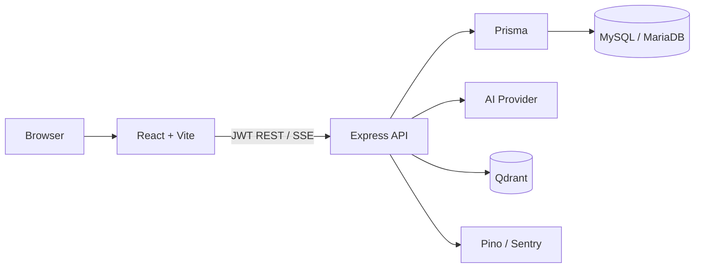
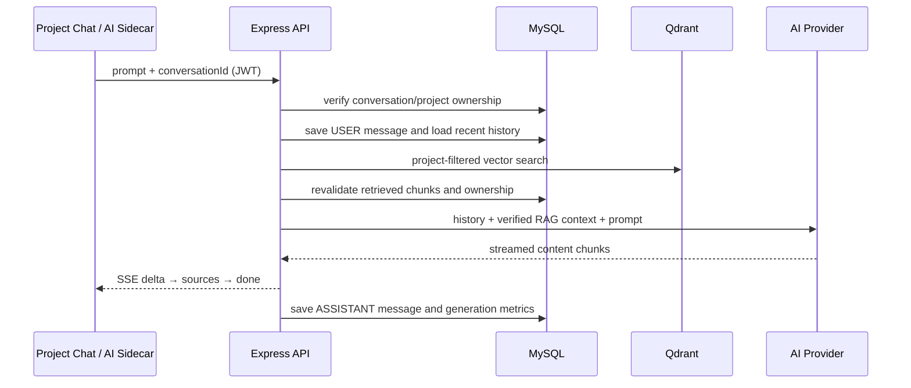

# MindCraft AI

MindCraft AI 是一个以 Project 为上下文边界的 AI 内容创作与项目管理平台。用户可以在项目工作区管理文档与知识库，在 Tiptap 编辑器中通过 AI Sidecar 进行多轮创作，也可以使用 Project Chat 基于项目知识进行检索增强问答。

## 核心能力

- JWT 注册、登录与当前用户认证
- 多用户 Project / Document 数据隔离
- Project Workspace：文档、知识库、项目问答
- Tiptap 富文本编辑器及基础表格支持
- 约 1.6 秒防抖自动保存、串行保存与手动保存
- Document 历史版本快照、预览与恢复
- 多轮 Conversation / Message
- SSE 流式生成、停止、失败重试、复制与插入文档
- Document AI Sidecar 与 Project Chat
- Project Knowledge Base：文本上传、切片、删除和向量清理
- Embedding 与 Qdrant 向量检索
- Project 范围 RAG、MySQL ownership 二次校验与来源引用
- Overview、数据统计与个人设置
- Sentry 错误监控、Pino 结构化日志与 requestId
- Rate Limit、CORS allowlist、请求大小限制和启动环境校验
- Vitest 后端测试与 GitHub Actions CI

## 技术栈

| 层级 | 技术 |
| --- | --- |
| Frontend | React 19、TypeScript、Vite、React Router、TanStack Query、Zustand |
| Editor / UI | Tiptap、Marked、ECharts、Lucide React |
| Backend | Node.js、Express 5、TypeScript、SSE |
| Database | MySQL / MariaDB、Prisma 7、MariaDB adapter |
| Vector Database | Qdrant |
| AI | OpenAI-compatible Chat Completion 与 Embedding API |
| Observability | Sentry、Pino、requestId |
| Testing / CI | Vitest、TypeScript、ESLint、GitHub Actions |

## 架构





## RAG Workflow

```text
Markdown / TXT upload
→ fixed-size chunks
→ embedding
→ Qdrant upsert with project metadata
→ project-filtered retrieval
→ MySQL chunk + project + user ownership revalidation
→ verified context injection
→ LLM streaming
→ backend-derived source citations
```

Knowledge 文件删除和 Project 删除会同步清理关联的 Qdrant points。检索结果在进入模型上下文和来源列表前，还会通过 MySQL 的 Project ownership 进行二次校验。

## Security / Engineering

- JWT middleware 为受保护 API 提供当前用户身份。
- Project、Document、Conversation、Knowledge 与统计查询均按当前用户进行 ownership 校验。
- Auth、AI generation 与 Knowledge upload 使用独立的内存 Rate Limit。
- Production CORS 仅允许 `FRONTEND_URL` 配置的来源。
- JSON、URL-encoded 与 multipart upload 均有大小限制；Knowledge 文件保持 60 KB 上限。
- 启动时验证数据库、JWT、AI、Embedding、Qdrant 与 frontend origin 等关键环境变量，日志不输出 secret。
- Pino 输出结构化日志并关联 requestId；Sentry 捕获前后端未处理异常。
- GitHub Actions 在 push / pull request 到 `main` 时运行类型检查、后端测试、lint 与 frontend build。

## Local Development

### Prerequisites

- Node.js 22
- MySQL 或 MariaDB
- 可用的 OpenAI-compatible Chat / Embedding API
- Qdrant collection（项目启动逻辑会校验知识库 collection）

### Backend

```bash
cd backend
npm install
```

复制 `backend/.env.example` 为 `backend/.env`，填写本地配置。不要提交真实 secret。

```bash
npx prisma generate
npx prisma migrate dev
npm run dev
```

### Frontend

```bash
cd frontend
npm install
```

如需 Sentry，复制 `frontend/.env.example` 为 `frontend/.env` 并填写配置；未配置 DSN 时本地开发不会因此崩溃。

```bash
npm run dev
```

默认 frontend 地址为 `http://localhost:5173`，并应与 backend 的 `FRONTEND_URL` 一致。

## Testing

Backend：

```bash
cd backend
npx tsc --noEmit
npm test
```

Frontend：

```bash
cd frontend
npx tsc -b
npm run lint
npm run build
```

## Screenshots

发布作品集前建议补充真实产品截图：Overview、Project Workspace、Document Editor + AI Sidecar、Knowledge Base、Project Chat + RAG Citation、Statistics。本仓库当前不引用占位或虚构截图。

## Known Limitations

- Source Citation 仅随当前流式回答展示，尚未持久化到历史 Message。
- Rate Limit 使用单实例内存存储，多实例部署需要共享存储方案。
- `Document.content` 使用 MySQL `TEXT`，单篇文档受约 64 KB 存储上限约束。
- Backend Prisma CLI 的开发依赖链仍可能包含只能通过破坏性版本变更处理的 audit 告警；发布前应结合 Prisma 升级计划单独评估。
