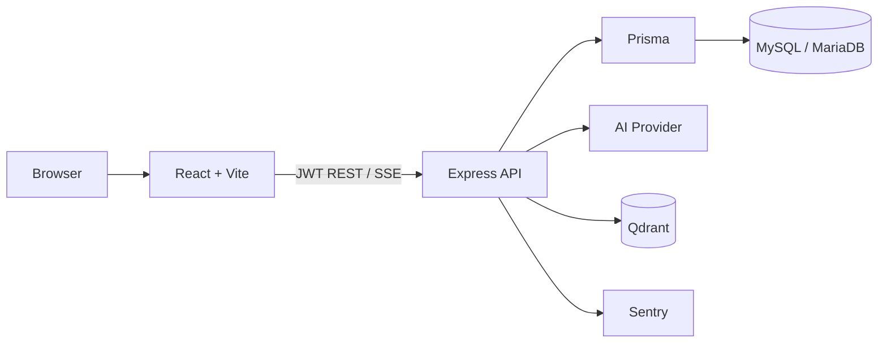

# MindCraft AI

MindCraft AI 是一个以 **Project 为上下文边界**的 AI 内容创作与项目管理平台。

用户可以在项目工作区中管理文档与知识库，在 Tiptap 编辑器中使用 AI Sidecar 进行多轮内容创作，也可以通过 Project Chat 基于项目知识进行 RAG 检索增强问答。


## 核心能力

- JWT 用户认证与多用户项目数据隔离
- Project Workspace：文档、知识库与项目问答
- Tiptap 富文本编辑、自动保存与版本历史
- AI Sidecar：多轮对话、SSE 流式生成、停止、重试与插入文档
- Project Knowledge Base：文本上传、切片、Embedding 与 Qdrant 向量检索
- Project RAG：知识检索、上下文增强与来源引用
- Overview、数据统计与个人设置
- 基础工程化：错误监控、接口限流、自动化测试与 GitHub Actions CI

## 技术栈

| 层级 | 技术 |
| --- | --- |
| Frontend | React、TypeScript、Vite、Tiptap、TanStack Query |
| Backend | Node.js、Express、TypeScript、Prisma |
| Database | MySQL / MariaDB、Qdrant |
| AI | OpenAI-compatible LLM、Embedding、RAG |
| Engineering | Vitest、Sentry、GitHub Actions |

## 系统架构



系统以 Project 作为主要业务边界。

普通业务数据由 MySQL 保存，知识库向量由 Qdrant 保存，AI 请求由 Backend 统一处理，并通过 SSE 将生成结果流式返回 Frontend。

## RAG Workflow

```text
Knowledge File
↓
文本切片
↓
Embedding
↓
Qdrant 向量存储
↓
用户提问
↓
向量检索
↓
MySQL Ownership 二次校验
↓
相关知识注入 LLM Context
↓
SSE 流式生成
↓
Source Citation
```

Knowledge 文件上传后会被切分并生成 Embedding，随后写入 Qdrant。

用户在 Project Chat 或 AI Sidecar 中提问时，Backend 会在当前 Project 范围内进行向量检索，并通过 MySQL 再次验证数据归属。

通过校验的知识片段会作为上下文发送给模型，最终来源引用由 Backend 根据真实检索结果生成，而不是由模型自行构造。

## 主要模块

### Project Workspace

每个 Project 提供统一工作区，用于组织：

- Documents
- Knowledge Base
- Project Chat

Project 同时也是文档、知识库和 AI 对话的上下文边界。

### Document Editor

基于 Tiptap 实现富文本编辑能力，并支持：

- 自动保存
- 手动保存
- 历史版本
- 版本恢复
- AI 内容插入

编辑器右侧提供 AI Sidecar，可以围绕当前文档进行连续多轮创作。

### AI Conversation

AI 对话采用 Conversation / Message 结构保存多轮上下文。

生成过程中 Backend 通过 SSE 持续返回内容，Frontend 可以实时展示模型输出，同时支持停止生成和失败重试。

### Project Knowledge Base

Project 可以上传文本知识文件。

文件经过切片与 Embedding 后保存到 Qdrant，并在 AI 问答时用于 Project 范围的 RAG 检索。

Knowledge 删除或 Project 删除时，会同步清理对应的向量数据。

## Engineering

- Project、Document、Conversation 与 Knowledge 等数据在 Backend 进行用户 ownership 校验。
- Auth、AI generation 与 Knowledge upload 等接口增加基础 Rate Limit、CORS 和环境配置检查。
- 使用 Vitest 进行 Backend 测试，并通过 GitHub Actions 执行类型检查、测试、Lint 和 Frontend Build。
- 使用 Sentry 进行前后端异常监控。

## Local Development

### Prerequisites

- Node.js 22
- MySQL 或 MariaDB
- Qdrant
- 可用的 OpenAI-compatible Chat / Embedding API

### Backend

```bash
cd backend
npm install
```

复制：

```text
backend/.env.example
```

为：

```text
backend/.env
```

并填写本地环境配置。

然后运行：

```bash
npx prisma generate
npx prisma migrate dev
npm run dev
```

### Frontend

```bash
cd frontend
npm install
npm run dev
```

如需使用 Sentry，可根据：

```text
frontend/.env.example
```

创建本地环境配置。

> 不要将真实 API Key、JWT Secret 或其他敏感环境变量提交到 Git 仓库。

## Testing

Backend：

```bash
cd backend
npx tsc --noEmit
npm test
```

Frontend：

```bash
cd frontend
npx tsc -b
npm run lint
npm run build
```

## Known Limitations

- Source Citation 当前主要随本次 AI 流式回答展示，尚未持久化到历史 Message。
- Rate Limit 当前使用单实例内存存储，多实例部署时需要引入共享存储方案。